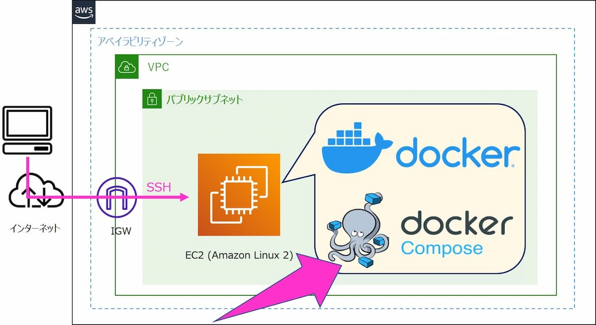

## Infra Diagram:


### Description:
1. Client had a well establised product running on Azure apps service as backend and VM as frontend. <br/>
2. The frontend was created in ReactJS and Backend was created DotNet. <br/>
3. They want to have a solution which can run both AWS and Azure with Multi-tenant architecture. <br/>

## Website:
     https://m9999.dev.mandatlyonline.net

### Used Apps:
1. Amazon EKS, where backend api i.e DotNet is deployed. <br/>
2. Amazon S3 where reactjs was deployed to host a static website. <br/>
3. Amazon ECR to store the container images. <br/>
4. Amazon CloudFront for path based routing. <br/>
5. Amazon Certificate Manager for SSL. <br/>

### Apps Into:
1. **Amazon EKS**: <br/>
                    a. It s a managed Kubernetes service to run you containers.  <br/>
                    b. It gives you the advantage of all the performance like scale, reliability, and availability of AWS infrastructure, as well as integrations with AWS networking & security services <br/>

2. **Amazon S3**: <br/>
                     a. It is an object storage service, which main purpose is to store the static objects like photo etc. <br/>
                     b. It also give the advantage to host the static website. <br/>

3. **AWS ECR**: <br/>
            a. It is a fully managed container registry where you can save deploy application images and artifacts. <br/>

4. **Amazon CloudFront**: <br/>
                    a. It is a is a content delivery network (CDN) service built for high performance, security. <br/>
                    b. It works like a loadbalancer which help to route your traffic according to your convenience in all regions. <br/>
                    c. It also works with path based routing for example: <br/>
                        ``````
                        website.com\api ====> backend
                        website.com\index.html ====> frontend
                        ``````

5. **Amazon Certificate Manager**: <br/>
                    a. It provision, manage, & deploy public & private SSL/TLS certificates for use with AWS services.
                    b. It removes the time-consuming manual process of purchasing, uploading, & renewing SSL/TLS certificates.

### Solution:
1. We find out that their fronted was static so we decided to host that on S3 backed by cloudfront to call 
2. We used the same container to run the apps on the beanstalk.
3. The reason to choose beanstalk instead of fargate because it is more cheeper then fargate & client's developer was his handy direty on it.
4. We created 2 branch in the repo one for dev and one for prod and connected with codepipeline through a oath read token.
5. The token gives access to codepipeline to pull the code, and along with dockerfile we also create a buildspec.yml & appspec.yml file.
6. Buildspec.yml & appspec.yml is a template file which gives instruction to codebuild & codedeply about the steps you want to perform on them.
7. Whenever developer push the code in github the codebuild build a docker image with the help of dockerfile and push it to ECR and then after codedeploy deploy the same dockerimage in beanstalk.
